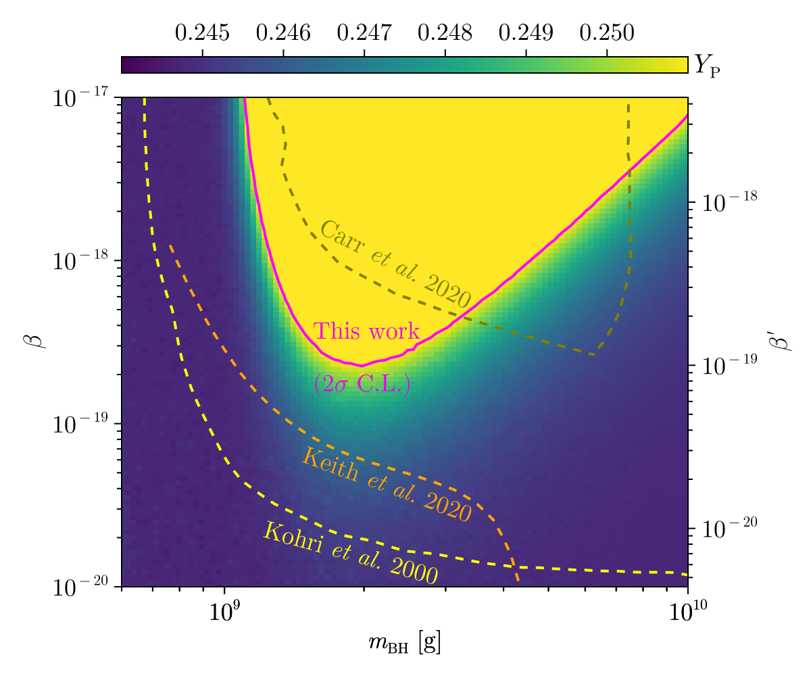

# Code Repository for [arXiv:2509.05618](https://arxiv.org/abs/2509.05618)

## Preliminaries

The Julia programming language is required to run the code in this repository.
All of the code has been tested with Julia v1.11.6, and may work with other versions.
To install Julia, please visit the official website: https://julialang.org/.
In addition, the following Julia packages are needed:
```julia-repl
pkg> st
Status `/path/to/Project.toml`
  [7e558dbc] ArbNumerics v1.6.2
  [13f3f980] CairoMakie v0.15.6
  [944b1d66] CodecZlib v0.7.8
  [82cc6244] DataInterpolations v8.6.0
  [8bb1440f] DelimitedFiles v1.9.1
  [0c46a032] DifferentialEquations v7.16.1
  [1fa38f19] Format v1.3.7
  [f6369f11] ForwardDiff v1.1.0
  [92d709cd] IrrationalConstants v0.2.4
  [033835bb] JLD2 v0.6.1
  [b964fa9f] LaTeXStrings v1.4.0
  [61adfb09] NaturalUnits v0.1.0 `https://github.com/Fenyutanchan/NaturalUnits.jl.git#main`
  [ab9774ad] PYTHIA8 v0.2.2
  [276daf66] SpecialFunctions v2.5.1
```
We provide a script [`tool_script-environment_initialization.jl`](./tool_script-environment_initialization.jl) to initialize the environment automatically by running `julia tool_script-environment_initialization.jl` directly.

## Contents

### Scripts and Notebooks

- `./tool_script-*.jl`: These are some useful scripts, _e.g._, to initialize the environment, to invoke `BlackHawk`, to define some useful functions, etc.
    Please refer to their contents for details.

- [`main.ipynb`](./main.ipynb): The main notebook to reproduce the results and some figures (Fig. 1, 3, 4, and **5**) in our paper [arXiv:2509.05618](https://arxiv.org/abs/2509.05618), where Fig. 5 is our main result:
    

- [`main-scan.jl`](./main-scan.jl): In this script, we copy the relevant code from `main.ipynb` to perform a scan over the parameter space.
    For convenience, we split the parameter setting part into [`main-scan-parameters.jl`](./main-scan-parameters.jl).
    One can run `julia --project --procs=<number of processes> main-scan.jl` to execute the script.

- [`main-scan-parameters.jl`](./main-scan-parameters.jl): This script contains the parameters used in `main-scan.jl`.
    One can modify the parameters in this script to perform a scan with different settings of parameters space.

- Other scripts: Please refer to them for details.

### Directories

- [`Pythia8_tables_scripts/`](./PYTHIA8_table_scripts/): There are two scripts to generate the tables by using `PYTHIA v8.3` in this directory.

    - [`table_up.jl`](./PYTHIA8_table_scripts/table_up.jl): The script is presented for generate the table for up quarks.
        You can run `julia --project --procs=<number of processes> table_up.jl` to execute the script.
    - [`table_gluon.jl`](./PYTHIA8_table_scripts/table_gluon.jl): The script is presented for generate the table for gluons.
        You can run `julia --project --procs=<number of processes> table_gluon.jl` to execute the script.

    These two scripts in Julia programming language are ported from the original `C++` code provided [`BlackHawk v2.3`](https://blackhawk.hepforge.org/).

- [`data/`](./data/): Data directory for input and output.

    - [`ext/`](./data/ext/): This directory contains some input data files that would be used in our code, which are imported from external sources.

    - [`out/`](./data/out/): This directory is the output data directory, where our code will save the output data files here.

- [`external_code/`](./external_code/): This directory is the working directory for the external code, where our code will download and compile the external code automatically.

    - `BlackHawk_v2.3/`: This directory would be created automatically when you run the code in [`valid_mesons_from_BlackHawk.ipynb`](./valid_mesons_from_BlackHawk.ipynb).
    - [`BlackHawk_v2.3-hack/`](./external_code/BlackHawk_v2.3-hack/): To invoke `BlackHawk` in our code correctly, some modifications should be made to the original code, which are archived in this directory.

- [`plots/`](./plots/): This directory contains some of figures that presented in our paper [arXiv:2509.05618](https://arxiv.org/abs/2509.05618).

### Julia Environment Files
- [`Artifacts.toml`](./Artifacts.toml): The TOML file for Julia artifacts.

- [`Project.toml`](./Project.toml): The TOML file for Julia project.

- `Manifest.toml`: The TOML file for Julia manifest, which would be generated automatically when you initialize the environment.

## Citation Information

```bibtex
TBA...
```
